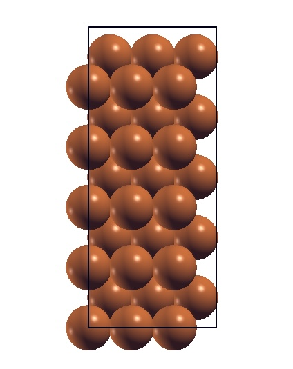
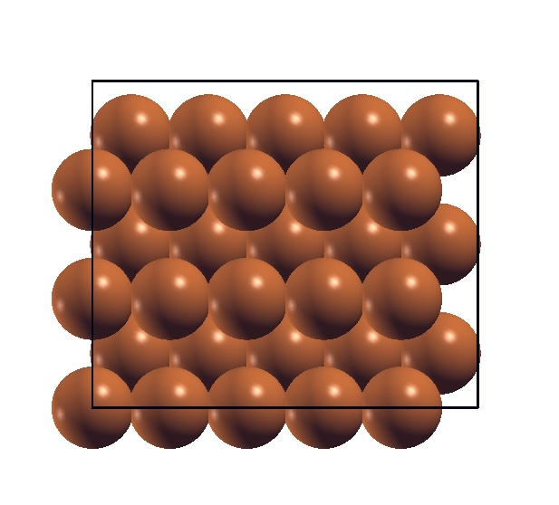

# Cu(110)スラブについて

(3x5)のユニットセル表面を作る際、
今回の研究では(1x1)単位セルあたり12x12x1のk点を取っているので、
インプットファイルのK_POINTSは4x3x1にしています。

また、(3x5)でモデリングすると



のように縦長になるので、(5x3)でモデリングして



この形でscfを回してみました。

インプットファイルは以下のようになっています。

```

 &control
  calculation  = 'scf'
  restart_mode = 'from_scratch',
  pseudo_dir   = '~/QE/pseudo/',
  outdir       = './tmp/'
  prefix       = 'Cu'
 !tstress      = .true.
  tprnfor      = .true.
  forc_conv_thr = 1.0d-4
 !verbosity    = 'high'
  nstep        = 400
  max_seconds  = 1700
 /
 &system
  ibrav        = 0
  nat          = 60
  ntyp         = 1
 !ecutwfc      = 80.0
 !ecutrho      = 640.0
  ecutwfc      = 60.0
  ecutrho      = 480.0
  nbnd         = 600
  occupations  = 'smearing'
  smearing     = 'mp'
  degauss      = 0.02
  assume_isolated = 'esm'
  esm_bc       = 'bc1'
  input_dft    = 'vdW-DF2-B86R'
 /
 &electrons
  diagonalization = 'david'
  conv_thr        = 1.0e-10
  mixing_beta     = 0.3
  electron_maxstep = 300
 /
 &ions
 /
ATOMIC_SPECIES
 Cu 0.0 Cu.pbe-spn-kjpaw_psl.1.0.0.UPF
CELL_PARAMETERS (angstrom)
   12.61357471526260         0.00000000000000           0.00000000000000
    0.00000000000000        10.70297305939830           0.00000000000000
    0.00000000000000         0.00000000000000          29.01122184510340
ATOMIC_POSITIONS (angstrom)
Cu      0.00000000000000        0.00000000000000        0.00000000000000
・
・
・
Cu      11.35221724373630       8.91914421616522        -3.78407241457877    0   0   0
K_POINTS (automatic)
 3 4 1   0   0   0

```

またアウトプットファイルより

```
Starting wfcs are  600 randomized atomic wfcs

```
と記載があるのでバンド数は640ぐらいで良いのかなと考えています。

<br>

追記　

電子の数
```
number of electrons       =      1140.00
```

k点の数
```
    number of k points=     6  Methfessel-Paxton smearing, width (Ry)=  0.0200
                       cart. coord. in units 2pi/alat
        k(    1) = (   0.0000000   0.0000000   0.0000000), wk =   0.1666667
        k(    2) = (   0.0000000   0.2946278   0.0000000), wk =   0.3333333
        k(    3) = (   0.0000000  -0.5892557   0.0000000), wk =   0.1666667
        k(    4) = (   0.3333333   0.0000000   0.0000000), wk =   0.3333333
        k(    5) = (   0.3333333   0.2946278   0.0000000), wk =   0.6666667
        k(    6) = (   0.3333333  -0.5892557   0.0000000), wk =   0.3333333
```

<br>

ジョブスクリプト

```
#!/bin/sh
#SBATCH -J Cu_sf_vdW
#SBATCH -p i8cpu
#SBATCH -N 8
#SBATCH -n 256


module load intel_compiler/2020.4.304
module load intel_mpi/2020.4.304
#
INPUT_FILE='cu.in'
OUTPUT_FILE='cu.out'
#

ln -fs /home/k0227/k022707/QE/src/qe-6.8/bin/pw.x ./pw.x

srun ./pw.x < ${INPUT_FILE} > ${OUTPUT_FILE}
```
